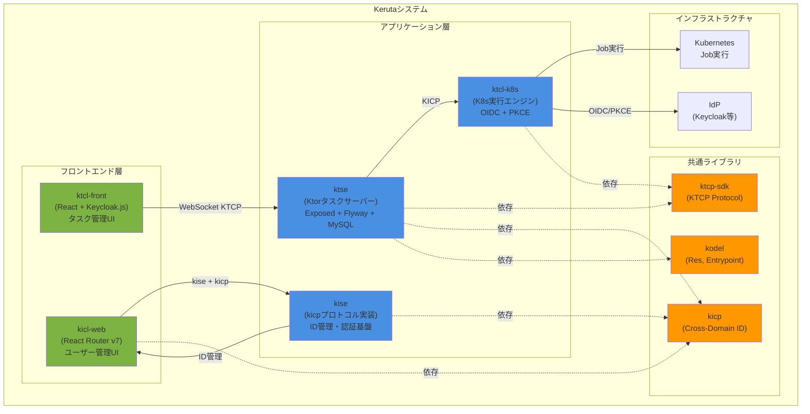
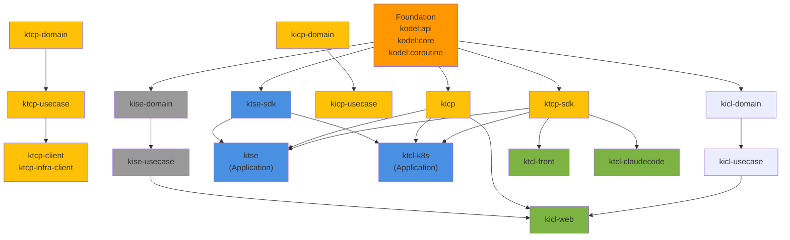
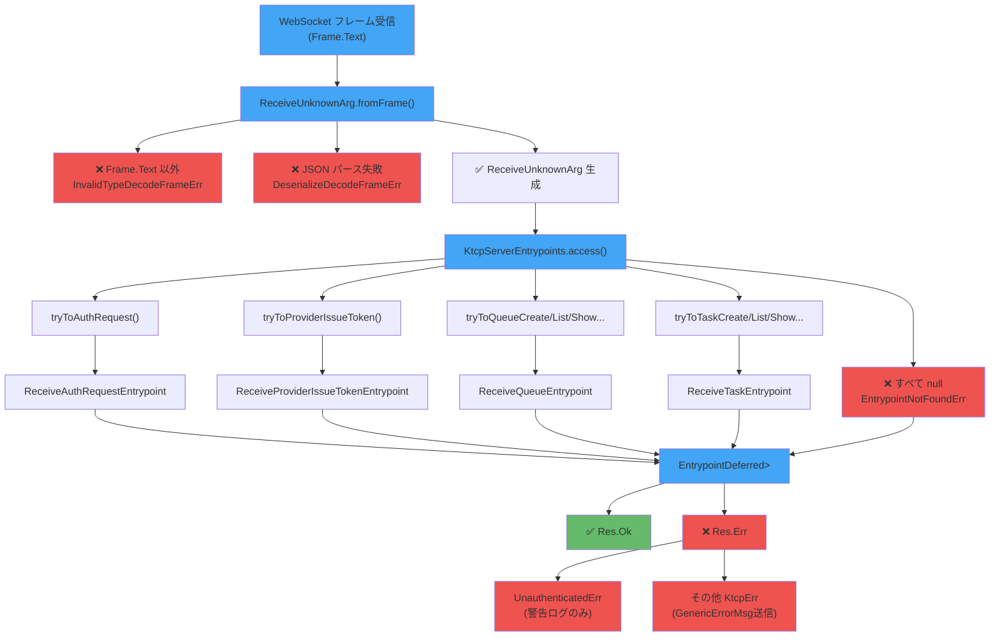
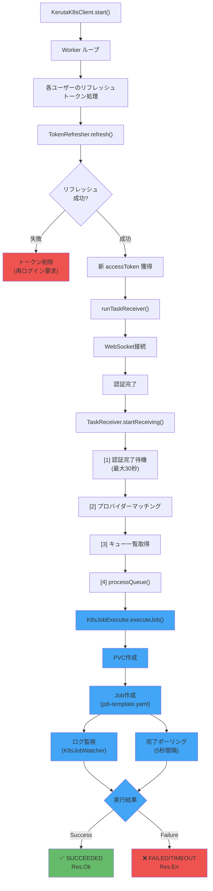
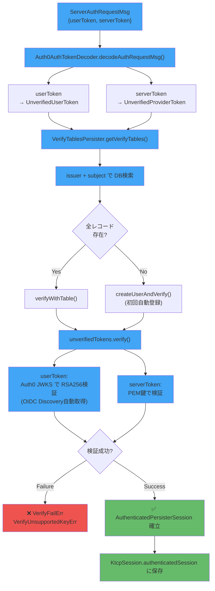
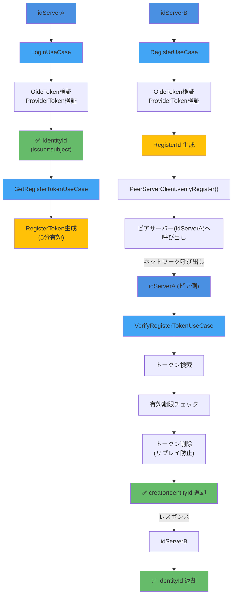

# アーキテクチャ

## 目次

1. [システム概要](#1-システム概要)
2. [モジュール構成](#2-モジュール構成)
3. [モジュール間依存関係](#3-モジュール間依存関係)
4. [コアアーキテクチャパターン](#4-コアアーキテクチャパターン)
5. [プロトコル層（KTCP）](#5-プロトコル層ktcp)
6. [アプリケーション層](#6-アプリケーション層)
7. [認証・認可](#7-認証認可)
8. [データベース・永続化層](#8-データベース永続化層)
9. [フロントエンド構成](#9-フロントエンド構成)
10. [ビルド・デプロイ構成](#10-ビルドデプロイ構成)
11. [エラーハンドリング階層](#11-エラーハンドリング階層)
12. [セッション管理](#12-セッション管理)

---

## 1. システム概要

Kerutaは、KubernetesベースのタスクオーケストレーションシステムとクロスドメインID連携プロトコルを組み合わせた分散システムです。

### システム全体図



### 主要コンポーネントの役割

| コンポーネント | 役割 | 通信方式 |
|---|---|---|
| **ktse** | タスク管理サーバー（中央ハブ） | WebSocket (KTCP), HTTP |
| **ktcl-k8s** | タスクをKubernetes Jobとして実行 | WebSocket (KTCP), HTTP |
| **ktcl-front** | 既存Webフロントエンド（React + Keycloak.js） | HTTP/REST |
| **kicl-web** | ユーザー管理のインターフェースモジュール（React Router v7 + KMP統合） | kiseサーバー（kicpプロトコル） |
| **kise** | Keruta専用IDサーバー（kicpプロトコル実装、ID管理・認証基盤） | HTTP, WebSocket |

---

## 2. モジュール構成

### モジュール全体マップ

```
keruta/
├── kodel/                  # 共通基盤ライブラリ（Foundation Layer）
│   ├── kodel:api           #   Res<T,E>, Entrypoint, Kogger
│   ├── kodel:core          #   DI基盤 (LazyProvider, SingletonProvider)
│   └── kodel:coroutine     #   ConcurrentLruCache, TtlCache, CounterInDuration
│
├── ktcp-sdk/               # WebSocketプロトコルライブラリ（KMP対応）
│   ├── ktcp-domain         #   ドメイン層: メッセージ型, Entrypointインターフェース
│   ├── ktcp-domain-server  #   サーバー固有ドメイン（Auth0 JWT対応）
│   ├── ktcp-usecase        #   ユースケース: JsonKerutaSerializer, JwtTokenCreator
│   ├── ktcp-infra-client   #   Ktor WebSocket Client実装
│   └── client              #   クライアントエントリーポイント
│
├── kicp/                   # クロスドメインID連携プロトコル仕様（KMP対応）
│   ├── kicp-domain         #   ポートインターフェース、値オブジェクト、エラー型（プロトコル定義）
│   └── kicp-usecase        #   LoginUseCase, RegisterUseCase等（プロトコルロジック）
│
├── kicl/                   # Kotlin Multiplatformライブラリ（Web向け）
│   ├── kicl-domain         #   KiclDomain object (VERSION定数)
│   └── kicl-usecase        #   KicpClientRegistrar
│
├── ktse/                   # Ktorタスクサーバー（JVMアプリケーション）
├── ktse-sdk/               # KTSE SDK
│   ├── ktse-sdk            #   ドメイン層（KMP: JVM, JS）
│   └── ktse-sdk-usecase    #   ユースケース層
│
├── ktcl-k8s/               # K8sクライアント（JVMアプリケーション）
├── ktcl-claudecode/        # Claude Code統合クライアント
├── ktcl-front/             # 既存フロントエンド（React + Vite、タスク管理UI）
├── ktcl-front-mobile/      # モバイルアプリ（Compose）
├── kicl-web/               # ユーザー管理のインターフェースモジュール（React Router v7 + KMP、kise/kicp統合）
└── kise/                   # Keruta IDサーバー（kicpプロトコル実装、開発中、JVM）
    ├── kise-domain         #   認証・ユーザー管理ドメイン
    ├── kise-usecase        #   認証・登録ユースケース（kicpプロトコルロジック）
    └── kise                #   HTTP + WebSocket + OIDC + kicp実装
```

### 各モジュールの詳細

#### kodel（共通基盤）

全モジュールの基盤となるライブラリ。KMP非依存の純粋なKotlinライブラリ。

| サブモジュール | 主要クラス・インターフェース | 役割 |
|---|---|---|
| `kodel:api` | `Res<T, E>`, `Entrypoint<I, O, C>`, `Kogger`, `UrlBase` | コアAPI定義 |
| `kodel:core` | `LazyProvider<T>`, `SingletonProvider<T>`, `DepProviders` | 手動DIサポート |
| `kodel:coroutine` | `ConcurrentLruCache<K, V>`, `TtlCache<K, V>`, `CounterInDuration` | コルーチンユーティリティ |

#### ktcp-sdk（WebSocketプロトコル）

双方向型安全WebSocketプロトコル「KTCP（Keruta Task Control Protocol）」の実装。Kotlin Multiplatformで、JVM・JS・WasmJSに対応。

| サブモジュール | 対象プラットフォーム | 主要コンポーネント |
|---|---|---|
| `ktcp-domain` | JVM, JS, WasmJS | `KtcpServerEntrypoints`, `KtcpClientEntrypoints`, `ReceiveUnknownArg` |
| `ktcp-domain-server` | JVM | Auth0 JWT対応の追加ドメイン型 |
| `ktcp-usecase` | JVM | `JsonKerutaSerializer`, `JwtTokenCreator` |
| `ktcp-infra-client` | JVM | Ktor WebSocket Client実装 |

KTCPがサポートするメッセージグループ:

| グループ | メッセージ例 |
|---|---|
| auth | `ServerAuthRequestMsg`, `ClientAuthSuccessMsg`, `ClientGenericErrorMsg` |
| provider | `ServerProviderIssueTokenMsg`, `ServerProviderCompleteMsg`, `ClientProviderListedMsg` |
| queue | `ServerQueueCreateMsg`, `ServerQueueListMsg`, `ClientQueueListedMsg` |
| task | `ServerTaskCreateMsg`, `ServerTaskListMsg`, `ClientTaskListedMsg` |

#### kicp（クロスドメインID連携プロトコル）

異なるドメイン間でユーザーIDを安全にフェデレーションするプロトコル仕様。KMP対応（JVM, JS）。**kiseサーバーがこのプロトコルを実装**し、クロスドメイン認証・登録機能を提供。

**kicp-domain のポート定義:**

| インターフェース | 役割 |
|---|---|
| `JwksRepository` | URL からJWKS取得（キャッシュはinfra実装） |
| `JwtVerifier` | JWTをJWKSで検証 → `TokenClaims` |
| `RegisterTokenRepository` | 登録トークンの保存・検索・削除 |
| `RegisterTokenGenerator` | ランダムな`RegisterToken`生成 |
| `CurrentTimeMs` | 現在時刻（epoch ms）取得 |
| `PeerServerClient` | 相手サーバーへの登録トークン検証呼び出し |

**kicp-usecase の4ユースケース:**

| ユースケース | 実行サーバー | 処理概要 |
|---|---|---|
| `LoginUseCase` | 両方 | providerToken + oidcToken 検証 → `IdentityId` |
| `GetRegisterTokenUseCase` | idServerA | 認証済みIDに登録トークン発行（有効期限付き） |
| `RegisterUseCase` | idServerB | トークン検証 + ピアサーバーへ確認 |
| `VerifyRegisterTokenUseCase` | idServerA | ピアからの登録トークン検証 → 元`IdentityId`返却 |

---

## 3. モジュール間依存関係



### 依存の方向ルール

- **下位層は上位層に依存しない**（Clean Architecture）
- `domain` → 外部依存なし（純粋なKotlinコード）
- `usecase` → `domain` のみ依存
- `infra` → `domain` + 外部ライブラリ（Ktor, Exposed等）
- `application` → 全層を統合

### モジュール別依存ライブラリ

| モジュール | 主要依存ライブラリ |
|---|---|
| `ktse` | Ktor 3.5.0, Exposed 1.3.0, Flyway 12.6.2, MySQL 9.7.0, Zookeeper |
| `ktcl-k8s` | Ktor 3.5.0, kubernetes-client 26.0.0, Exposed 1.3.0 |
| `ktcp-sdk` | Ktor WebSocket（JVM側）, kotlinx.serialization |
| `kicp` | kotlinx.serialization, Ktor（JVM infra層） |
| `kicl-web` | React Router v7, Vite, KMP生成JSライブラリ |

---

## 4. コアアーキテクチャパターン

### 4.1 Res\<T, E\> パターン（型安全なエラーハンドリング）

例外を使わない関数型エラーハンドリング。`Err` はすべて `Throwable` サブクラスで、スタックトレース情報を保持。

```kotlin
sealed interface Res<out T, out E : Throwable> {
    data class Ok<T, E : Throwable>(val value: T) : Res<T, E>
    data class Err<T, E : Throwable>(val err: E) : Res<T, E>
}
```

**基本パターン:**

```kotlin
// when による分岐
when (val r = someOperation()) {
    is Res.Err -> return r.convert()   // エラー型を伝搬
    is Res.Ok -> r.value               // 成功値を取得
}

// ユーティリティ
.convertOk { transform(it) }          // 成功値変換
.convertErr { wrapErr(it) }           // エラー型変換
.flatConvertOk { syncOp(it) }         // Res<Res<T,E>,E> → Res<T,E>（非suspend専用）
.whenOkErr(onOk, onErr)               // 分岐実行
```

> **注意**: `flatConvertOk` はsuspend関数のチェーンには使えない。`when` を使うこと。

### 4.2 Entrypointパターン（型安全なメッセージルーティング）

プロジェクト中核の設計パターン。型安全な双方向WebSocketメッセージルーティングを実現。

```kotlin
interface Entrypoint<in I, out O, C> {
    suspend fun exec(arg: I, ctx: C): O
}
```

エントリーポイントのクラス階層（タスク作成の例）:

```
ServerTaskCreateEntrypoint<C>           ← インターフェース（プロトコル定義）
  ├── ReceiveTaskCreateEntrypoint       ← サーバー側実装（受信処理）
  └── SendTaskCreateEntrypoint          ← クライアント側実装（送信処理）
```

- コンテキスト型（`ServerCtx` / `ClientCtx`）でサーバー/クライアントを区別
- コンテキストからセッション、シリアライザ、サーバー状態にアクセス可能
- 14種のメッセージタイプを `KtcpServerEntrypoints<C>` / `KtcpClientEntrypoints<C>` でルーティング

### 4.3 手動DIとFactoryパターン

KMP対応のためDIフレームワーク不使用。`{Component}Factory` クラスで依存性を手動組み立て。

```kotlin
class LoginUseCaseFactory(
    private val jwksRepository: JwksRepository,
    private val jwtVerifier: JwtVerifier,
) {
    fun create(): LoginUseCase = LoginUseCaseImpl(jwksRepository, jwtVerifier)
}
```

`kodel:core` の `LazyProvider<T>` / `SingletonProvider<T>` でライフサイクル管理。

### 4.4 Clean Architecture（domain/usecase分離）

KMPライブラリモジュール（ktcp-sdk, kicp, kicl等）の標準構造:

```
{module}-domain/   ← エンティティ、値オブジェクト、ポートインターフェース
{module}-usecase/  ← アプリケーションサービス（インターフェース + *Impl クラス）
{module}-infra/    ← 外部システム実装（別モジュールに分離）
```

- `domain` 層はフレームワーク依存なし（KMP対応の根拠）
- `usecase` 層は `domain` インターフェースのみに依存（テスト容易性）
- インフラ実装（Ktor HTTP, Exposed DB等）は上位モジュールに配置

---

## 5. プロトコル層（KTCP）

### 5.1 メッセージ受信フロー

クライアントから受信したWebSocketフレームを型判定し、対応するエントリーポイントに渡す。



### 5.2 メッセージ送信フロー（サーバー → クライアント）

```
1. エントリーポイントが SendXxxArg を作成
2. ctx.server.clientEntrypoints.xxx でエントリーポイント取得
3. ctx.serializer.serialize(msg) でシリアライズ
4. connection.send(serializedMsg) で送信
```

### 5.3 シリアライゼーション

- インターフェース: `KerutaSerializer`（`ktcp-sdk`）
- 実装: `JsonKerutaSerializer`（`ktcp-usecase`、kotlinx.serialization）
- `ClientMsg` / `ServerMsg` のシールドインターフェースでポリモーフィックシリアライズ
- 型判別子: `ClientMsgTypeSerializer`, `ServerMsgTypeSerializer`

---

## 6. アプリケーション層

### 6.1 ktse（タスクサーバー）

KtorベースのWebSocketサーバー。タスクの作成・管理・配信を担当。

**パッケージ構成:**

```
net.kigawa.keruta.ktse/
├── auth/           # 二重トークン認証
│   ├── Auth0AuthTokenDecoder   # JWT デコード + OIDC Discovery
│   ├── KtseJwtVerifier         # JWT検証実装
│   ├── Auth0JwtVerifier        # Auth0専用検証
│   └── ProviderVerifier        # プロバイダー検証
├── persist/        # DB永続化層（Exposed + Flyway）
│   ├── accessor/               # DAOクラス
│   ├── db/table/               # UserTable, ProviderTable, QueueTable, TaskTable
│   ├── kicp/                   # KICP統合実装
│   └── ExposedPersisterSession # DBトランザクション管理
├── websocket/      # KtorWebsocketModule
│   └── entrypoint/             # メッセージ処理エントリーポイント
├── kicp/           # KICP実装（infra）
│   ├── JwksRepositoryImpl
│   ├── JwtVerifierImpl
│   └── PeerServerClientImpl
├── err/            # BackendErr型階層
└── zookeeper/      # 分散キューイング
```

**起動フロー:**

```
Main.kt
  → KerutaTaskServer.start()
  → KtorWebsocketModule.websocketModule()
  → WebSocket接続 /ws/ktcp
  → KtcpServerEntrypoints でルーティング
```

### 6.2 ktcl-k8s（Kubernetes実行クライアント）

KtorベースのHTTP + WebSocketクライアント。タスクを受信してKubernetes Jobとして実行。

**パッケージ構成:**

```
net.kigawa.keruta.ktcl.k8s/
├── auth/           # JWT検証, TokenRefresher（リフレッシュ自動更新）
├── config/         # IdpConfig（IdP接続設定）
├── connection/     # WebSocket接続管理
├── k8s/            # K8sJobExecutor, K8sJobWatcher
├── kicp/           # KICP実装（idServerB として機能）
├── login/          # OIDC + PKCE認証フロー
│   ├── LoginRoute          # GET /login
│   ├── LoginCallbackRoute  # GET /login/callback
│   └── OidcSession         # セッション管理
├── persist/        # DB永続化（ユーザー・トークン管理）
│   └── dao/                # UserDao, UserTokenDao, UserClaudeConfigDao
├── route/          # HTTP APIルーティング
├── serialize/      # シリアライザ
├── task/           # TaskReceiver（タスク受信ループ）
└── web/            # Ktor Server設定（KTCL_K8S_WEB_MODE=true で有効）
```

**タスク実行フロー:**



### 6.3 kise（IDサーバー、開発中）

Keruta専用のIDプロバイダー。既存ktseの認証機能を分離・拡張する計画。

**主要機能（予定）:**

- OIDC準拠のJWT発行・検証
- 複数IdP対応（統合認証基盤）
- KICP統合（クロスドメインID連携）
- WebSocket + HTTP 両対応

---

## 7. 認証・認可

### 7.1 ktse：二重トークン認証

KTCP WebSocket接続時に、ユーザーJWT（OIDC）とプロバイダーJWTの両方を同時検証。



**JWKキャッシュ:** LRUキャッシュ（最大8発行者）、OIDC Discoveryで`jwks_url`自動取得。

### 7.2 ktcl-k8s：OIDC + PKCE認証

HTTPブラウザ経由のOIDC認証。PKCEで認可コードインターセプション攻撃を防止。

```
ユーザー → GET /login
  → PKCE生成（code_verifier + code_challenge=BASE64URL(SHA256(verifier))）
  → IdPへリダイレクト（state, code_challenge, S256）

IdP → GET /login/callback?code=xxx&state=yyy
  → state検証（CSRF防止）
  → POST /token（code + code_verifier → access_token + refresh_token）
  → IDトークン検証（署名, issuer, audience, expiry）
  → UserDao.findOrCreate() → セッション作成 → Cookie設定
```

**トークンリフレッシュ:** バックグラウンドWorkerが全ユーザーのリフレッシュトークンを定期更新。失敗時はトークン削除（再ログイン要求）。

### 7.3 プロバイダー登録フロー

```
(認証済み状態で)
ServerProviderIssueTokenMsg 受信
  → JwtTokenCreator.create(audience="provider_register") → 1時間有効JWT
  → ClientProviderAddTokenMsg で返却

外部プロバイダーがJWTを用いて自身のトークン生成

ServerProviderCompleteMsg { registerToken, userToken, serverToken } 受信
  → 3トークンをすべて検証
  → provider レコードDB保存
  → ClientProviderIdpAddedMsg 送信
```

### 7.4 KICP：クロスドメインID連携

詳細は [kicp.md](../domain/kicp.md)(kicp.md) を参照。



`IdentityId` は OIDC の `issuer:subject` で構成。登録トークンは1回使用で即削除（リプレイ攻撃防止）。

---

## 8. データベース・永続化層

### 8.1 テーブル構成（ktse）

Flyway（V001〜V006）によるスキーマ管理。

```
user
  ├─ id          BIGINT PK
  └─ create_at   TIMESTAMP

user_idp                    ← ユーザー ↔ IdP 関係
  ├─ id          BIGINT PK
  ├─ user_id     FK → user
  ├─ subject     VARCHAR    （OIDC sub）
  ├─ issuer      VARCHAR    （OIDC issuer）
  └─ UNIQUE(subject, issuer)

provider                    ← 認証プロバイダー
  ├─ id          BIGINT PK
  ├─ user_id     FK → user
  ├─ issuer      VARCHAR
  ├─ audience    VARCHAR
  ├─ name        VARCHAR
  └─ UNIQUE(user_id, issuer, audience)

queue                       ← タスクキュー
  ├─ id          BIGINT PK
  ├─ provider_id FK → provider
  └─ name        VARCHAR

queue_user                  ← キュー ↔ ユーザー（多対多）
  ├─ id          BIGINT PK
  ├─ queue_id    FK → queue
  ├─ user_id     FK → user
  └─ UNIQUE(queue_id, user_id)

task                        ← タスク
  ├─ id          BIGINT PK
  ├─ user_id     FK → user
  ├─ queue_id    FK → queue
  ├─ name        VARCHAR
  ├─ status      ENUM(pending, running, completed, failed)
  └─ create_at   TIMESTAMP
```

### 8.2 永続化層実装

- ORM: **Exposed 1.3.0**（DSL + DAOスタイル混用）
- マイグレーション: **Flyway 12.6.2**
- DB: **MySQL 9.7.0**（テスト: Testcontainers）
- トランザクション管理: `ExposedPersisterSession`（`newSuspendedTransaction` ラップ）

### 8.3 ktcl-k8s のDB構成

ktcl-k8s は独自のDB（H2またはMySQL）でユーザートークン情報を管理:

| テーブル | 用途 |
|---|---|
| `user` | ユーザー基本情報 |
| `user_token` | リフレッシュトークン保管 |
| `user_claude_config` | Claude Code実行設定 |

詳細は [database.md](../infra/database.md)(database.md) を参照。

---

## 9. フロントエンド構成

### 9.1 ktcl-front（既存フロントエンド）

| 項目 | 内容 |
|---|---|
| フレームワーク | React + Vite |
| 認証 | Keycloak.js |
| ビルド成果物 | Dockerイメージ（nginx） |
| 通信 | KTCP WebSocket（直接） |

### 9.2 kicl-web（ユーザー管理のインターフェースモジュール）

ユーザー管理画面を提供するWebアプリケーション。**kiseサーバー** が実装する **kicpプロトコル** 経由で通信し、ユーザーのID・アカウント情報を管理する。KMP（Kotlin Multiplatform）モジュールと統合され、サーバーサイドロジックをクライアントで再利用可能。

詳細は [kicl-web.md](../infra/kicl-web.md)(kicl-web.md) を参照。

| 項目 | 内容 |
|---|---|
| 位置付け | ユーザー管理UI（ID・アカウント管理） |
| **認証要件** | **全ページでログイン必須**（kise + kicp） |
| 通信方式 | kiseサーバー（kicpプロトコル実装） |
| フレームワーク | React Router v7 + TypeScript + Vite |
| ルーティング | ファイルベース（`app/routes/`） |
| KMP統合 | `kicl`モジュール生成のJSライブラリを参照 |
| 主要ページ | `index.tsx`（ホーム）, `settings.tsx`（設定） |
| 主要コンポーネント | `Nav.tsx`（ナビゲーション） |
| デプロイ | Dockerイメージ（`harbor.kigawa.net/private/kicl-web`） |

```
kicl-web/
├── app/
│   ├── components/     # 共通UIコンポーネント
│   ├── routes/         # ページコンポーネント
│   ├── types/          # AppSettings等の型定義
│   ├── root.tsx        # レイアウト
│   └── routes.tsx      # ルート定義
└── react-router.config.ts
```

---

## 10. ビルド・デプロイ構成

### 10.1 Gradleプロジェクト構成

依存バージョンは `buildSrc/src/main/kotlin/Version.kt` で一元管理。

**主要バージョン:**

| ライブラリ | バージョン |
|---|---|
| Kotlin | 2.3.0 |
| Ktor | 3.5.0 |
| Exposed | 1.3.0 |
| Flyway | 12.6.2 |
| MySQL Connector | 9.7.0 |
| java-jwt (Auth0) | 4.5.2 |
| kubernetes-client | 26.0.0 |
| JUnit Jupiter | 6.1.0 |
| MockK | 1.14.2 |
| Node.js | 24 |

**buildSrcプラグイン一覧:**

| プラグイン | 用途 |
|---|---|
| `root.gradle.kts` | グループ/バージョンを `VERSION` 環境変数から設定 |
| `kmp.gradle.kts` | Kotlin Multiplatform基本設定（JVM, JS, WasmJS） |
| `serialize.gradle.kts` | kotlinx.serialization |
| `jvm.gradle.kts` | JVMのみモジュール向け基本設定 |
| `ktcp-base.gradle.kts` | KTCP共通依存（kodel:api） |
| `ktcp-model.gradle.kts` | KTCP model（KMP） |
| `ktcp-model-server.gradle.kts` | KTCP model + Auth0 JWT |
| `ktcp-server.gradle.kts` | KTCP server（Ktor WebSocket + コルーチン） |
| `ktcp-client.gradle.kts` | KTCP client |
| `ktor-server.gradle.kts` | Ktor server基本 |
| `ktor-server-websocket.gradle.kts` | Ktor WebSocket追加 |
| `compose-mobile-app.gradle.kts` | モバイルアプリ（Compose） |
| `ktcl-web.gradle.kts` | Web client |

### 10.2 Dockerイメージ

| Dockerfile | 成果物 | 用途 |
|---|---|---|
| `Dockerfile_ktse` | `harbor.kigawa.net/library/ktse` | タスクサーバー |
| `Dockerfile_ktcl_k8s` | `harbor.kigawa.net/library/ktcl-k8s` | K8sクライアント |
| `Dockerfile_ktcl_front` | `harbor.kigawa.net/private/ktcl-front` | タスク管理UI（nginx） |
| `Dockerfile_kicl_web` | `harbor.kigawa.net/private/kicl-web` | ユーザー管理UI（nginx） |
| `Dockerfile_ktcl_claudecode` | - | Claude Code統合 |

### 10.3 CI/CD

- **`develop`ブランチへのpush** → GitHub Actions `dev.yml` が自動ビルド・デプロイ
- ビルド成果物を **Harbor Registry** へpush
- **ArgoCD** が kigawa-net-k8sマニフェストリポジトリを更新してデプロイ

詳細は [ci-convention.md](ci-convention.md) を参照。

---

## 11. エラーハンドリング階層

```mermaid
graph TD
    Throwable["Throwable"]
    
    KtcpErr["KtcpErr<br/>(プロトコル層エラー)"]
    KtcpServerErr["KtcpServerErr"]
    UnauthenticatedErr["UnauthenticatedErr<br/>(認証前の操作)"]
    VerifyErr["VerifyErr"]
    VerifyFailErr["VerifyFailErr<br/>(署名・クレーム不一致)"]
    VerifyUnsupportedKeyErr["VerifyUnsupportedKeyErr<br/>(未対応アルゴリズム)"]
    DeserializeErr["DeserializeErr<br/>(デシリアライズ失敗)"]
    ResponseErr["ResponseErr<br/>(送信失敗)"]
    EntrypointNotFoundErr["EntrypointNotFoundErr<br/>(未知メッセージ)"]
    IllegalFormatDeserializeErr["IllegalFormatDeserializeErr<br/>(JSON形式不正)"]
    InvalidTypeDeserializeErr["InvalidTypeDeserializeErr<br/>(型不一致)"]
    
    KicpErr["KicpErr<br/>(Cross-Domain ID層)"]
    JwksFetchErr["JwksFetchErr<br/>(JWKS取得失敗)"]
    TokenVerificationErr["TokenVerificationErr<br/>(JWT検証失敗)"]
    RegisterTokenNotFoundErr["RegisterTokenNotFoundErr<br/>(トークン未発見)"]
    RegisterTokenExpiredErr["RegisterTokenExpiredErr<br/>(期限切れ)"]
    PeerVerificationErr["PeerVerificationErr<br/>(ピア呼び出し失敗)"]
    
    BackendErr["BackendErr<br/>(KTSE固有)"]
    NoSingleRecordErr["NoSingleRecordErr<br/>(レコード不一致)"]
    MultipleRecordErr["MultipleRecordErr<br/>(重複レコード)"]
    
    KiseErr["KiseErr<br/>(ID Server、開発中)"]
    InvalidTokenErr["InvalidTokenErr"]
    TokenExpiredErr["TokenExpiredErr"]
    ProviderNotFoundErr["ProviderNotFoundErr"]
    SessionNotFoundErr["SessionNotFoundErr"]
    UserNotFoundErr["UserNotFoundErr"]
    
    Throwable --> KtcpErr
    Throwable --> KicpErr
    Throwable --> BackendErr
    Throwable --> KiseErr
    
    KtcpErr --> KtcpServerErr
    KtcpErr --> EntrypointNotFoundErr
    KtcpErr --> IllegalFormatDeserializeErr
    KtcpErr --> InvalidTypeDeserializeErr
    
    KtcpServerErr --> UnauthenticatedErr
    KtcpServerErr --> VerifyErr
    KtcpServerErr --> DeserializeErr
    KtcpServerErr --> ResponseErr
    
    VerifyErr --> VerifyFailErr
    VerifyErr --> VerifyUnsupportedKeyErr
    
    KicpErr --> JwksFetchErr
    KicpErr --> TokenVerificationErr
    KicpErr --> RegisterTokenNotFoundErr
    KicpErr --> RegisterTokenExpiredErr
    KicpErr --> PeerVerificationErr
    
    BackendErr --> NoSingleRecordErr
    BackendErr --> MultipleRecordErr
    
    KiseErr --> InvalidTokenErr
    KiseErr --> TokenExpiredErr
    KiseErr --> ProviderNotFoundErr
    KiseErr --> SessionNotFoundErr
    KiseErr --> UserNotFoundErr
    
    classDef protocol fill:#4A90E2
    classDef kicp fill:#FFC107
    classDef backend fill:#FF9800
    classDef indev fill:#999
    
    class KtcpErr,KtcpServerErr,UnauthenticatedErr,VerifyErr,VerifyFailErr,VerifyUnsupportedKeyErr,DeserializeErr,ResponseErr,EntrypointNotFoundErr,IllegalFormatDeserializeErr,InvalidTypeDeserializeErr protocol
    class KicpErr,JwksFetchErr,TokenVerificationErr,RegisterTokenNotFoundErr,RegisterTokenExpiredErr,PeerVerificationErr kicp
    class BackendErr,NoSingleRecordErr,MultipleRecordErr backend
    class KiseErr,InvalidTokenErr,TokenExpiredErr,ProviderNotFoundErr,SessionNotFoundErr,UserNotFoundErr indev
```



**エラー対処早見表:**

| エラー型 | 発生箇所 | 対処 |
|---|---|---|
| `UnauthenticatedErr` | 全エントリーポイント | 警告ログのみ（切断しない） |
| `VerifyFailErr` | 認証処理 | `GenericErrMsg` 送信 |
| `EntrypointNotFoundErr` | WSルーティング | `GenericErrMsg` 送信 |
| `JwksFetchErr` | KICP | `Res.Err` として伝搬 |
| `RegisterTokenExpiredErr` | KICP | トークン削除 + エラー返却 |
| `NoSingleRecordErr` | DB操作 | アプリケーション層でハンドル |

---

## 12. セッション管理

### KTSE WebSocketセッション

| 設定 | 値 |
|---|---|
| 無通信タイムアウト | 1分間 |
| エラー許容数 | 30分の時間窓で3回まで |
| 認証状態保持 | `MutableStateFlow<AuthenticatedSession?>` |
| ライフサイクル | `WebsocketModule` で開始、`coroutineScope` 内で実行 |

セッションのタイムアウト管理:

```kotlin
// フレーム受信のたびに呼び出し
KtcpSession.updateTimeout()

// 1分間無受信 → 切断
// 30分窓で3エラー超過 → 切断
```

### ktcl-k8s HTTPセッション

| 設定 | 値 |
|---|---|
| セッション管理方式 | `OidcSession` + Cookie |
| トークン更新 | バックグラウンドWorkerがリフレッシュトークンで自動更新 |
| トークン失効時 | DBからトークン削除（再ログイン要求） |

### KICPトークン

| 設定 | 値 |
|---|---|
| 登録トークン有効期限 | 5分 |
| 使用制限 | 1回のみ（使用後即削除・リプレイ防止） |
| 期限切れトークン | 検証時に即削除 |
